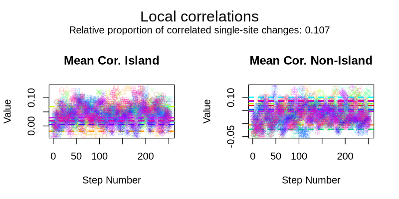
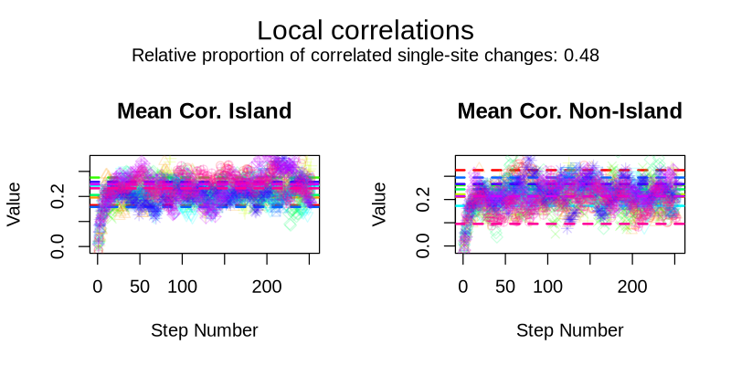
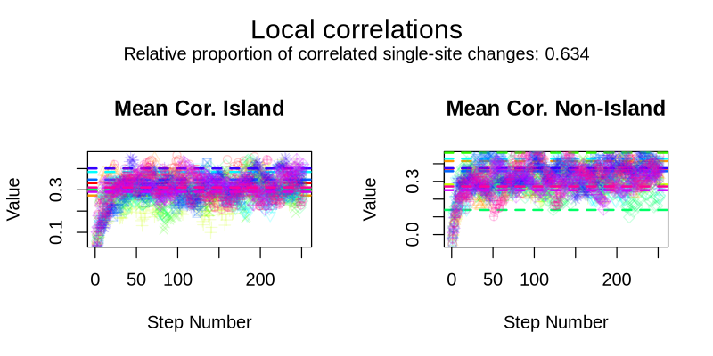
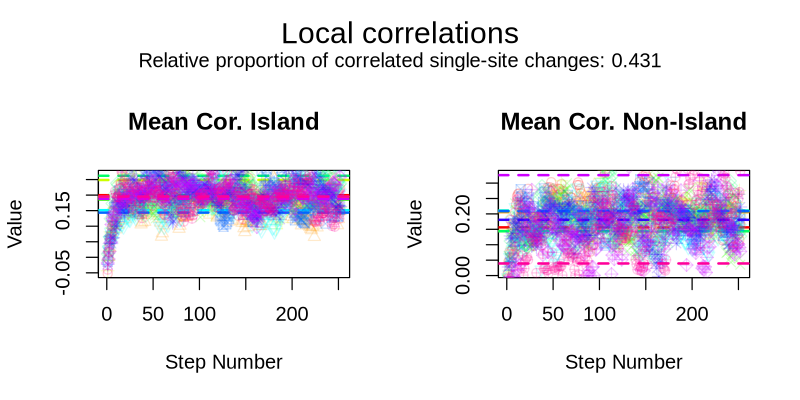
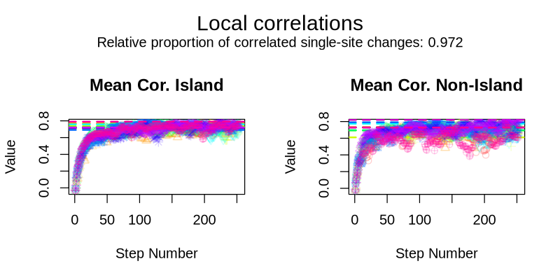

```{r, include = FALSE}
knitr::opts_chunk$set(
  collapse = TRUE,
  comment = "#>"
)
```

```{r setup}
#library(MethEvolSIM)
library(devtools)
load_all()
```

**Update way in which MethEvolSIM is loaded**

# Introduction

The initialization of the DNA methylation data without the CFTP method
samples for each genomic structure (island or  non-island) the
methylation state for each of the CpG sites within from the
structure's equilibrium frequencies independently.
Therefore, the initial distribution of methylation states lacks the
effect of the neighbor correlations introduced by the correlated SSE process.
This correlations would then build during evolution along a branch. 

In order to be able to start simulating evolution along a tree
with the sequence of states at the tree root accounting for the
neighbouring correlations we implemented the CFTP method,
which samples a sequence of methylation states from the equilibrium given
by the model (accounting for the correlated SSE process while neglecting the IWE process.)

**Add examples of use**

CFTP method is defaulted to FALSE but can be set to TRUE when simulating initial data or data evolution along a tree.

Sample initial data with the sequence of methylation states according to the equilibrium.

```{r}
# Example with sampled initial methylation frequencies and default parameter values
custom_infoStr <- data.frame(n = c(100, 100, 100),
                             globalState = c("M", "U", "M"))
initialD <- simulate_initialData(infoStr = custom_infoStr, CFTP = TRUE)
```

Simulate evolution of data along a tree calling the CFTP method to sample a sequence of methylation states at the root of the tree from the equilibrium.

```{r}
# Example with customized initial methylation frequencies, customized parameter values 
# and default dt (0.01)
tree <- "((a:1, b:1):2, c:2, (d:3.7, (e:4, f:1):3):5);"
custom_infoStr <- data.frame(n = c(10, 10, 10),
                             globalState = c("M", "U", "M"),
                             u_eqFreq = c(0.1, 0.8, 0.1),
                             p_eqFreq = c(0.1, 0.1, 0.1),
                             m_eqFreq = c(0.8, 0.1, 0.8))
custom_params <- get_parameterValues()
custom_params$mu <- 0.005

evolD <- simulate_evolData(infoStr = custom_infoStr, tree = tree, params = custom_params, CFTP = TRUE)
```


## Visual Examples

To ease understanding of how applying CFTP results in sampling an initial sequence of methylation states from the equilibrium towards which the data would evolve when initial data neglects local correlations, we provide the plots obtained while testing the method. The test was performed on 10 parameter combinations as the model equilibrium is dependent on those. It uses as summary statistics the mean correlation of a central segment of methylation states per genomic structure type (see vignette for summary statistics **add link or reference or exact name here**). When simulating without using CFTP, the initial sequence of methylation states is given by the independent sampling of the methylation state of the sites from the equilibrium frequencies of the genomic structure to which they belong. Then, the local correlations between the sites methylation states build up with evolutionary time.

Therefore, we expect that the value of the increases with the increase of evolutionary time until it converges towards the equilibrium given by the corresponding parameter combination. We track its value by discretizing the evolution along a tree branch (representing linear time) in small steps (of length 0.01). Additionally, we call the CFTP method on the initial data to sample the sequence of methylation states from the equilibrium and compute its corresponding value for the summary statistics. We expect the distribution of the summary statistics obtained by calling the CFTP method to be representative of the equilibrium obtained after the branch evolution has reached the equilibrium.

In the following figures, the y axis represents the value of the mean correlation summary statistics and the x axis represents the number of discretized time steps. Each figure corresponds to one of the 10 sampled parameter combinations and for each parameter combination 10 replicates were simulated, represented with the different colors. Dots (with a different shape for each of the replicates) represent the value of the mean correlation at the given time step and the dashed line represents its value after calling CFTP on the initial data.















### Reproducibility

The test used to generate the visual example is provided as a workflow, which can be run using [Snakemake](https://snakemake.readthedocs.io) or by running the scripts separatedly. Here, we describe the structure and content of the Snakemake workflow. However, the scripts that comprise the workflow are available under `extensive_tests/CFTP_convergence/scripts`.


#### Workflow Requirements

-   Dependencies are listed on the file `environment.yaml`. Before running the workflow, a conda environment can be created with:

```{bash, eval = FALSE}
conda env create -n cftp_testConvergence -f environment.yaml
```

Then, the workflow can be run by:

```{bash, eval = FALSE}
conda activate cftp_testConvergence
snakemake --use-conda
```

When using nohup one can activate the environment as in the following command.

```{bash, eval = FALSE}
# E.g. running the run_sim rule
nohup conda run -n cftp_testConvergence snakemake run_sim &
```

-   Provided `Snakefile`, `config.yaml` and associated scripts.

#### Steps in the Workflow

All the given parameters to the workflow steps are taken from the `config.yaml` file.

1.  Rule `get_spatial_str` run by script `get_spatial_str.R`. The test simulates data on a simplified genomic structure alternating island and non-island regions each a given number of times and each (`Str_n`) with a constant number of CpGs  (`CpG_n`). The output is a file named as `methSite_genomicDist` under the directory `dir`.

2.  Rule `set_design` run by script `set_sim_design.R`. Takes as input the output of the previous rule. For a number of model parameter combinations `n_sim` and setting a seed `seed` for reproducibility, samples the parameter combinations from the prior distributions as defined in `prior_distributions`. The output is a file named "design.RData" under the directory `dir` containing both the spatial structure defined in the first rule and the sampled parameters. *Note that this script already corrects the values of* $\iota$ *and* $\alpha_{R_i}$ *in the sampled parameters to be a minimum of 1e-2*.

3.  Rule `run_sim` run by script `run_sim.R`. Takes as input the output of the previous rule. For each parameter combination it simulates a number of replicates (`replicate_n`) and (1) simulates evolution along a branch of length `branch_length` a number of times from `start` to `end` and (2) calls the CFTP method on the initial data. Each replicate is simulated with a seed obtained as the index of the corresponding parameter combination * 1000 + the replicate number for reproducibility. The output files are written under the directory `dir` and named "CFTP_testConvergence_paramsID_{parameter_combination_number}_rep_{replicate_number}_{step_n}.RData" for the output of evolution along the branch and "CFTP_testConvergence_paramsID_{parameter_combination_number}_rep_{replicate_number}_cftp.RData" for the output of the cftp method. **Need to update the way in which the package is loaded before submitting**

4.  Rule `compute_meanCor` run by script `compute_meanCor.R`. Takes as input the output of the previous rule. For each branch step output and cftp output it computes the mean correlation of a segment of methylation states per genomic structure type (**summary statistics described in the summaryStats vignette**). The output files are written under the directory `dir` and are named as "summaryStats_CFTP_testConvergence_paramsID_{parameter_combination_number}_cftp.RData" for the output of the cftp method and ""summaryStats_CFTP_testConvergence_paramsID_{parameter_combination_number}_rep_{replicate_number}.RData" for the output of evolution along the branch.

5.  Rule `plot_results` run by script `plot.R`. Takes as input the output of the previous rule.  The output files are written under a subdirectory `Figures` generated in the same directory of the snakemake workflow, and are named "CFTP_testConvergence_paramsID_{parameter_combination_number}" both in `.pdf` and `.png` format.


# TO ADD

- Add references

- Simplify sentences

- Step in the Workflow and then mention Snakemake and conda as an additional option.
 
- Instead of whan using nohup, if using nohup

- Break lines shorter to be able to compare versions with gitk.


