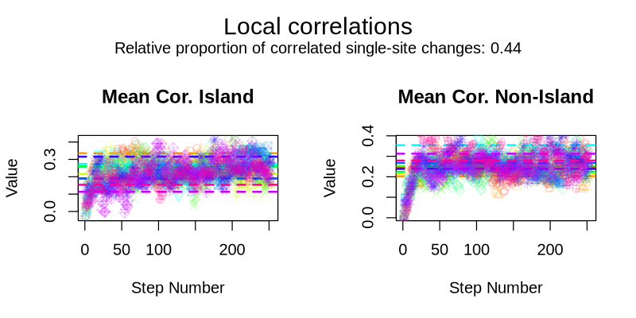
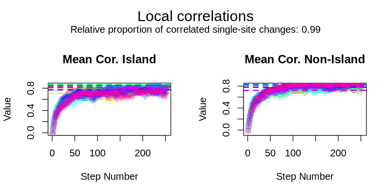
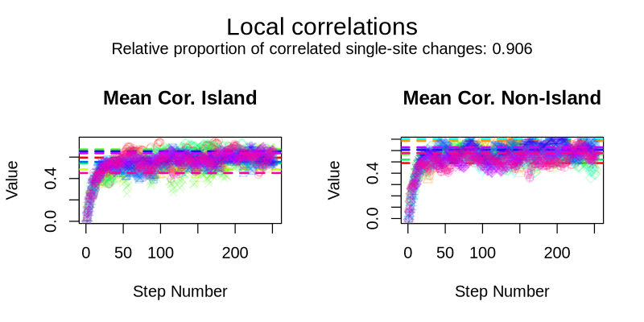
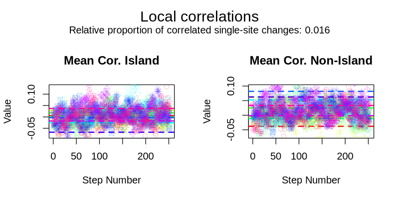

```{r, include = FALSE}
knitr::opts_chunk$set(
  collapse = TRUE,
  comment = "#>"
)
```

```{r setup}
library(MethEvolSIM)
```


# Introduction

Without the CFTP method, the initial methylation states are sampled independently 
for each CpG site based on the equilibrium frequencies of its genomic structure 
(island or non-island).
As a result, the initial distribution lacks neighbor
correlations of the correlated Single-Site Event (SSE) process.
These correlations develop over time during evolution along a branch.

To ensure the that root sequence includes neighbor correlations, we adapted the Coupling 
From The Past (CFTP) algorithm (see @ProppWilson96, @ProppWilson98 for details).
This method samples methylation states from the model's equilibrium 
accounting for the correlated SSE process.
Note that in the current implementation CFTP neglects the Island-Wide Event Process
and thus in particular the reduction of neighbor-specific correlations within CpG islands after
and island-wide event.

# Use examples

The CFTP method can be applied when simulating
initial methylation data with `simulate_initialData` or when simulating data evolution
along a tree with `simulate_evolData` with the argument `CFTP`.
The default value for this argument is FALSE but can be set to TRUE to apply the
CFTP algorithm initial data or at the root of the tree.

Example: Sample initial data with the sequence of methylation states according to 
the equilibrium.

```{r}
# Example with sampled initial methylation frequencies and default parameter values
custom_infoStr <- data.frame(n = c(100, 100, 100),
                             globalState = c("M", "U", "M"))
initialD <- simulate_initialData(infoStr = custom_infoStr, CFTP = TRUE)
```

Example: Simulate evolution of data along a tree calling the CFTP method to sample 
a sequence of methylation states at the root of the tree from the equilibrium.

```{r}
# Example with customized initial methylation frequencies, customized parameter values 
# and default dt (0.01)
tree <- "((a:1, b:1):2, c:2, (d:3.7, (e:4, f:1):3):5);"
custom_infoStr <- data.frame(n = c(10, 10, 10),
                             globalState = c("M", "U", "M"),
                             u_eqFreq = c(0.1, 0.8, 0.1),
                             p_eqFreq = c(0.1, 0.1, 0.1),
                             m_eqFreq = c(0.8, 0.1, 0.8))
custom_params <- get_parameterValues()
custom_params$mu <- 0.005

evolD <- simulate_evolData(infoStr = custom_infoStr, tree = tree, params = custom_params, CFTP = TRUE)
```

# Convergence and Convergence Approximations

Applying the CFTP method increases run time and memmory requirements. This increase
depends on the parameterization used for the given simulation.
For example, a combination of high $\iota$ values (leading to the SSE process being mostly independent)
and low $\alpha_{Ri}$ values (leading to a high variation in the 3 rates of 
independent SSE) leads to some sites having a rate of change through the SSE process
of nearly 0, which results in a long runtime of the exact CFTP algorithm.
To limit the run time and memmory consumption for such cases, the
maximum number of steps used is limited with the argument `CFTP_step_limit`.
If after the limiting number of steps the algorithm has not converged, an approximation
is applied and a message will show:

"Steps limit reached. Applying approximation for CFTP."

The number of steps used by the algorithm is increased by subsequent iterations, 
so that the number of steps at each iteration $n$ given by:

$$\text{steps}_n = 10000 \cdot 2^{n-1}$$

The default value for `CFTP_step_limit` is set to `327680000`, allowing the 
algorithm to try 16 full iterations before applying the approximation.

# Visual Examples

To help understanding how CFTP samples an initial sequence of methylation states from
equilibrium, we provide plots from our tests.
The test used 10 parameter combinations since the model equilibrium depends on them.
The summary statistic used is the mean correlation of a central segment of
methylation states per genomic structure type (see vignette "Summary Statistics with MethEvolSIM").

Without CFTP, the initial states of the sequence are sampled independently based 
on the equilibrium frequencies of each genomic structure. Over time, local 
correlations between methylation states develop during evolution.
With CFTP, the initial states of the sequence are sampled from the equilibrium 
accounting for the correlated SSE process. Therefore, the local correlations are
already present in the initial states of the sequence.

Our test consists in comparing the change in correlations observed in a sequence
initiated without CFTP along evolutionary time to the correlations observed in a
sequence initiated with CFTP.
We expect the mean correlation of the sequence without CFTP to change with 
evolutionary time until it stabilizes at the equilibrium for the corresponding
parameter combination.
To track this, we discretize evolution along a tree branch into small steps of length 0.01. 
We also apply CFTP to the initial data, sampling a sequence of methylation states 
from equilibrium and computing the corresponding summary statistic. 
The distribution of the summary statistics computed for the sequence obtained
with the CFTP method should match the summary statistics equilibrium reached 
without the CFTP method after evolutionary time.

In the following figures, the y-axis represents the mean correlation, and the x-axis
shows the number of discretized time steps.
Each figure corresponds to one of the 10 parameter combinations.
For each combination, 10 replicates were simulated, shown in
different colors.
Dots (with unique shapes for each replicate) indicate the mean
correlation at each time step for the sequences initiated without CFTP. 
For each sequence, the line of the same color represents the value after applying
CFTP with the same CpG-island-specific equilibrium probabilities of the
methylation states as in the initialization of the non-CFTP simulations.
The plots show that CFTP leads to a correlation sampled from a distribution
to which the simulations without CFTP converge.













## Reproducibility

The test used to generate the visual example is provided as a workflow in 
[MethEvolSIM GitHub Repository](https://github.com/statgenlmu/MethEvolSIM), under
`/extensive_tests/CFTP_convergence`.
All scripts are provided and can be run independently, or as in our example,
using [Snakemake](https://snakemake.readthedocs.io). 
Here, we describe the structure and content of the workflow. 


### Workflow Requirements

-   Dependencies are listed on the file `environment.yaml`. They can be installed
previous to running the workflow or, alternatively,
a conda environment can be created with:

```{bash, eval = FALSE}
conda env create -n cftp_testConvergence -f environment.yaml
```

Then, the Snakemake workflow can be run by:

```{bash, eval = FALSE}
conda activate cftp_testConvergence
snakemake --use-conda
```

If using nohup one can activate the environment as in the following command.

```{bash, eval = FALSE}
nohup conda run -n cftp_testConvergence snakemake &
```

-   Provided: `environment.yaml`, `Snakefile`, `config.yaml` and associated scripts.

### Steps in the Workflow

All the given parameters to the workflow steps are taken from the `config.yaml` file.

1.  Rule `get_spatial_str` run by script `get_spatial_str.R`. 
It sets the spatial distribution of the sequence to simulate.
The test simulates data on a simplified genomic region alternating island and 
non-island structures each a given number of times (`Str_n`) and 
each with a constant number of CpGs (`CpG_n`). 
The output is a file named as `methSite_genomicDist` under the directory `dir`.

2.  Rule `set_design` run by script `set_sim_design.R`. 
Takes as input the output of the previous rule. For a number of model parameter 
combinations (`n_sim`) and setting a seed (`seed`) for reproducibility, 
samples the parameter combinations from the prior distributions as defined in
`prior_distributions`.
The output is a file named "design.RData" under the  directory `dir` containing
both the spatial structure defined in the first rule 
and the sampled parameters. 
*Note that this script corrects the values of* $\iota$ *and* $\alpha_{R_i}$ 
*in the sampled parameters to be a minimum of 1e-2*, 
*as that is the smallest value used in the implementation due to numerical limitations*.

3.  Rule `run_sim` run by script `run_sim.R`. 
Takes as input the output of the previous rule. 
For each parameter combination it simulates a number of replicates (`replicate_n`) and
each replicate is simulated with a seed obtained as the index of the corresponding 
parameter combination * 1000 + the replicate number for reproducibility. For each 
replicate it first generates initial data without the CFTP method and 
simulates evolution along a branch of length `branch_length` a number of times from `start` to `end` and, then calls the CFTP method on the previously generated initial data. 
The output files are written under the directory `dir` and named:

  - `"CFTP_testConvergence_paramsID_{parameter_combination_number}_rep_{replicate_number}_{step_n}.RData"`

  - `"CFTP_testConvergence_paramsID_{parameter_combination_number}_rep_{replicate_number}_cftp.RData"`


4.  Rule `compute_meanCor` run by script `compute_meanCor.R`. 
Takes as input the output of the previous rule. 
For each branch step output and cftp output it computes the mean correlation of 
a segment of methylation states per genomic structure type (see
vignette "Summary Statistics with MethEvolSIM"). 
The output files are written under the directory `dir` and are named:

- `"summaryStats_CFTP_testConvergence_paramsID_{parameter_combination_number}_cftp.RData"`

- `"summaryStats_CFTP_testConvergence_paramsID_{parameter_combination_number}_rep_{replicate_number}.RData"`


5.  Rule `plot_results` run by script `plot.R`. 
Takes as input the output of the previous rule.  
The output files are written under a subdirectory `Figures` generated in the 
snakemake directory (or the directory from where the R script is run if not using Snakemake),
and are named "CFTP_testConvergence_paramsID_{parameter_combination_number}" 
both in `.pdf` and `.png` format.

# References
